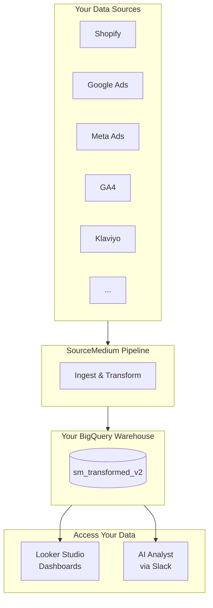

The AI Analyst queries your data in BigQuery through Slack. Before you can use it, your data infrastructure must be in place.

## How It Works



The AI Analyst and your Looker Studio dashboards query the same underlying data — they're just different interfaces.

---

## Prerequisites

Before installing the AI Analyst, ensure your SourceMedium data pipeline is set up:

<Steps>
  <Step title="Connect Your Data Sources">
    The AI Analyst queries data from your connected platforms. At minimum, you need:

    - **E-commerce platform** (Shopify, Amazon Seller Central)
    - **Marketing platforms** (Google Ads, Meta Ads, etc.)
    - **Web analytics** (GA4)

    <Card title="All Integrations" icon="plug" href="/data-inputs/platform-integration-instructions/all-available-integrations">
      See the full list of supported integrations.
    </Card>
  </Step>
  <Step title="Verify Data Is Flowing">
    After connecting integrations, SourceMedium ingests and transforms your data into BigQuery. This typically takes 24–72 hours for initial setup.

    Your SourceMedium team will notify you when your data is ready. You can also check:
    - Your Looker Studio dashboard is populated
    - Or ask your SourceMedium team for confirmation
  </Step>
  <Step title="Confirm BigQuery Access">
    The AI Analyst queries the `sm_transformed_v2` dataset in your BigQuery project. Your SourceMedium team handles this provisioning — no action needed from you unless you're self-hosting.

    <Card title="BigQuery Essentials" icon="database" href="/onboarding/analytics-tools/bigquery-essentials">
      Learn about your BigQuery data warehouse.
    </Card>
  </Step>
</Steps>

<Info>
If you're already using SourceMedium dashboards, your data infrastructure is ready — proceed to Slack installation.
</Info>

---

## Slack Installation

The AI Analyst is delivered as a Slack app called **SourceMedium**.

<Note>
In Slack, the bot appears as "SourceMedium" (or "SourceMedium (YourCompany)"). Throughout these docs, we refer to it as the "AI Analyst" to distinguish it from other SourceMedium products.
</Note>

### Your Tenant URL

Each SourceMedium customer has a dedicated instance:

```
https://{your-tenant}.sourcemedium.com
```

For example, if your tenant ID is `acme`, your URL would be `https://acme.sourcemedium.com`.

<Tip>
Not sure what your tenant ID is? It's typically your company name or a shortened version. Ask your SourceMedium team if you're unsure.
</Tip>

### Installing the App

<Steps>
  <Step title="Visit your install URL">
    Go to `https://{your-tenant}.sourcemedium.com/slack/install`
  </Step>
  <Step title="Click 'Add to Slack'">
    You'll be redirected to Slack's authorization page.
  </Step>
  <Step title="Review permissions">
    See what the app can access (details below).
  </Step>
  <Step title="Authorize">
    Click "Allow" to complete installation.
  </Step>
  <Step title="Start asking questions">
    Mention the bot in a channel or send it a direct message.
  </Step>
</Steps>

<Warning>
You must be a Slack workspace admin (or have app installation permissions) to install the AI Analyst.
</Warning>

---

## Permissions Requested

When you install the app, Slack shows the permissions being requested:

| Category | What It Enables |
|----------|-----------------|
| **Read messages** | See your questions in channels and DMs where the bot is present |
| **Send messages** | Reply with results, charts, and SQL queries |
| **Upload files** | Attach CSV exports, SQL files, and chart images |
| **Read user info** | Identify who asked the question for context |
| **Join channels** | Accept channel invitations when you add the bot |

<Info>
The bot only sees messages in channels where it's explicitly added or in direct messages sent to it. It cannot read messages in other channels.
</Info>

---

## After Installation

Once installed:

1. **Invite the bot to a channel**: Use `/invite @SourceMedium` or add it from channel settings
2. **Or use direct messages**: Send a DM to the SourceMedium bot for private queries
3. **Ask a question**: Type your question in natural language

The bot responds in a thread with your results.

<Tip>
Many teams create a dedicated `#analytics` or `#data-questions` channel for queries. This keeps analytics discussions organized and lets the whole team learn from each other's questions.
</Tip>

---

## Access Control

### Who Can Use It

Anyone in your Slack workspace who can message the bot can query your data. There's no separate login — Slack authentication is used.

### What Data Is Accessible

The AI Analyst can query all SourceMedium out-of-the-box tables for your tenant:

- Orders and revenue data
- Customer information
- Marketing and ad performance
- Email and SMS metrics
- Web analytics events
- Attribution data

<Warning>
Granular access control (limiting specific users to specific data) is not yet available. Anyone with access to the bot can query any data in your SourceMedium tables.
</Warning>

### Multi-Store Organizations

If your organization has multiple stores connected to SourceMedium, the AI Analyst can query data across all of them. Currently, queries return combined results across all stores in your tenant.

<Note>
Per-store filtering is on our [roadmap](/ai-analyst/roadmap). For now, include the store name in your question and the AI will attempt to filter appropriately if the data supports it.
</Note>

---

## Troubleshooting

### Data Issues

**"I'm not seeing recent data"**
- Check [Data Health](/ai-analyst/diagnostics/data-health) to verify table freshness
- Data typically refreshes daily; check with your SourceMedium team for your refresh schedule

**"The AI doesn't know about my tables"**
- The AI Analyst only queries SourceMedium out-of-the-box tables
- Custom tables or views you've created in BigQuery are not accessible

### Installation Issues

**"You don't have permission to install apps"**

Ask your Slack workspace admin to either:
- Install the app for you
- Grant you app installation permissions

**"This workspace is not authorized"**

Your Slack workspace may not be linked to your SourceMedium tenant. Contact your SourceMedium team to verify the configuration.

**Bot not responding after installation**

1. Make sure the bot is invited to the channel you're messaging in
2. Try sending a direct message to the bot instead
3. Check that you're mentioning the bot correctly (`@SourceMedium`)

---

## Getting Help

If you run into issues during setup:

- **Email**: support@sourcemedium.com
- **Slack**: Message your SourceMedium team in your shared channel

Include your tenant ID and a description of the issue.

---

## Related Resources

<CardGroup cols={2}>
  <Card title="Getting Started Checklist" icon="check" href="/onboarding/getting-started/getting-started-checklist">
    Full onboarding guide for new SourceMedium customers.
  </Card>
  <Card title="All Integrations" icon="plug" href="/data-inputs/platform-integration-instructions/all-available-integrations">
    Complete list of supported data sources.
  </Card>
</CardGroup>
