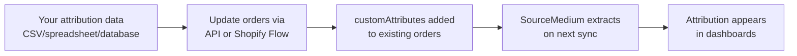
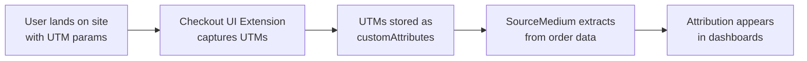

<Info>
**Audience**: This guide is for developers and technical teams who need to add UTM attribution data to Shopify orders—either backfilling historical orders or capturing UTMs for future orders.
</Info>

## Overview

SourceMedium extracts UTM attribution data from Shopify order-level `customAttributes`. This guide covers two scenarios:

1. **Backfilling existing orders** — You have attribution data (from spreadsheets, surveys, external tools) and want to write it to historical orders
2. **Capturing UTMs going forward** — You want to automatically capture UTM parameters at checkout for future orders

<CardGroup cols={2}>
  <Card title="Backfill Historical Orders" icon="clock-rotate-left" href="#backfilling-historical-orders">
    Use the Shopify Admin API to add attribution data to existing orders
  </Card>
  <Card title="Capture Future UTMs" icon="forward" href="#capturing-utms-for-future-orders">
    Use Checkout UI Extensions to automatically capture UTMs at checkout
  </Card>
</CardGroup>

---

## Supported Keys

SourceMedium extracts the following keys from `customAttributes`. **Keys are case-sensitive**—use exact lowercase.

| Key | Description | Example Value |
|-----|-------------|---------------|
| `utm_source` | Traffic source | `facebook`, `google`, `klaviyo` |
| `utm_medium` | Marketing medium | `cpc`, `email`, `social` |
| `utm_campaign` | Campaign name | `summer_sale_2025` |
| `utm_content` | Ad content identifier | `carousel_v2` |
| `utm_term` | Search term (paid search) | `running+shoes` |
| `utm_id` | Campaign ID | `120211234567890` |
| `gclid` | Google Click ID | `EAIaIQobChMI...` |
| `fbclid` | Facebook Click ID | `IwAR3x...` |
| `referrer` | Referring URL | `https://blog.example.com/review` |

<Warning>
**Case Sensitivity**: Keys must be exact lowercase. `UTM_SOURCE`, `Utm_Source`, and `utm_Source` will **not** be extracted.
</Warning>

---

## Backfilling Historical Orders

If you have attribution data for existing orders (e.g., from post-purchase surveys, manual tracking, or external tools), you can write it to Shopify orders so SourceMedium can extract it.

### How It Works



### Available Methods

| Method | Best For | Technical Skill Required |
|--------|----------|--------------------------|
| **Shopify Flow** | Small batches, no-code users, Shopify Plus | Low (no coding) |
| **Admin API Script** | Large bulk backfills, automation | Medium (Python/Node.js) |
| **Third-Party Apps** | Limited - most don't support order attributes | Varies |

<Note>
**No CSV import available**: Unlike products, Shopify does not support CSV import for order attributes. Matrixify and similar bulk import tools also do not support `customAttributes` on orders.
</Note>

---

### Option 1: Shopify Flow (No-Code)

If you have Shopify Plus, you can use **Shopify Flow** with the "Send Admin API request" action. This is ideal for smaller batches or when you want to trigger updates based on conditions.

<Steps>
  <Step title="Create a Flow workflow">
    Go to **Settings → Flow** and create a new workflow. Use a trigger like "Order created" for new orders, or tag orders you want to backfill and trigger on "Order tags added".
  </Step>
  <Step title="Add 'Send Admin API request' action">
    Select **GraphQL Admin API** and choose the **orderUpdate** mutation.
  </Step>
  <Step title="Configure the mutation">
    Use this template to preserve existing attributes while adding new ones:

    **Mutation:**
    ```graphql
    mutation orderUpdate($input: OrderInput!) {
      orderUpdate(input: $input) {
        order { id }
        userErrors { field message }
      }
    }
    ```

    **Variables (JSON with Liquid):**
    ```liquid
    {
      "input": {
        "id": "{{ order.id }}",
        "customAttributes": [
          
            { "key": "{{ attr.key }}", "value": "{{ attr.value }}" },
          ,
          { "key": "utm_source", "value": "facebook" },
          { "key": "utm_medium", "value": "cpc" }
        ]
      }
    }
    ```
  </Step>
</Steps>

<Warning>
The `orderUpdate` mutation **replaces all** `customAttributes`. The Liquid loop above preserves existing attributes—don't skip it or you'll lose data.
</Warning>

---

### Option 2: Admin API Script (Bulk)

For large backfills (hundreds or thousands of orders), use a script with the [Shopify Admin GraphQL API](https://shopify.dev/docs/api/admin-graphql/latest/mutations/orderUpdate).

#### Prerequisites

<Check>Shopify Admin API access with `write_orders` scope</Check>
<Check>Order IDs mapped to your attribution data</Check>
<Check>Attribution data in the supported key format (see table above)</Check>

#### Implementation

<Tabs>
  <Tab title="GraphQL Mutation">
    ```graphql
    mutation orderUpdate($input: OrderInput!) {
      orderUpdate(input: $input) {
        order {
          id
          customAttributes {
            key
            value
          }
        }
        userErrors {
          field
          message
        }
      }
    }
    ```

    **Variables:**
    ```json
    {
      "input": {
        "id": "gid://shopify/Order/1234567890",
        "customAttributes": [
          { "key": "utm_source", "value": "facebook" },
          { "key": "utm_medium", "value": "cpc" },
          { "key": "utm_campaign", "value": "summer_sale_2025" }
        ]
      }
    }
    ```
  </Tab>
  <Tab title="Python Script">
    ```python
    import shopify
    import csv

    # Initialize Shopify session
    shop_url = "your-store.myshopify.com"
    api_version = "2024-10"
    access_token = "your-access-token"

    session = shopify.Session(shop_url, api_version, access_token)
    shopify.ShopifyResource.activate_session(session)

    def backfill_order_attribution(order_id: str, attribution: dict):
        """
        Update an order with UTM attribution data.

        Args:
            order_id: Shopify order ID (numeric, e.g., "1234567890")
            attribution: Dict with keys like utm_source, utm_medium, etc.
        """
        # Build customAttributes array
        custom_attributes = [
            {"key": key, "value": value}
            for key, value in attribution.items()
            if value  # Skip empty values
        ]

        # GraphQL mutation
        query = """
        mutation orderUpdate($input: OrderInput!) {
          orderUpdate(input: $input) {
            order {
              id
              customAttributes { key value }
            }
            userErrors { field message }
          }
        }
        """

        variables = {
            "input": {
                "id": f"gid://shopify/Order/{order_id}",
                "customAttributes": custom_attributes
            }
        }

        result = shopify.GraphQL().execute(query, variables)
        return result

    # Example: Backfill from CSV
    with open('attribution_data.csv', 'r') as f:
        reader = csv.DictReader(f)
        for row in reader:
            order_id = row['order_id']
            attribution = {
                'utm_source': row.get('source', ''),
                'utm_medium': row.get('medium', ''),
                'utm_campaign': row.get('campaign', ''),
            }

            result = backfill_order_attribution(order_id, attribution)
            print(f"Updated order {order_id}: {result}")
    ```
  </Tab>
  <Tab title="Node.js Script">
    ```javascript
    import '@shopify/shopify-api/adapters/node';
    import { shopifyApi } from '@shopify/shopify-api';

    const shopify = shopifyApi({
      apiKey: process.env.SHOPIFY_API_KEY,
      apiSecretKey: process.env.SHOPIFY_API_SECRET,
      scopes: ['write_orders'],
      hostName: 'your-store.myshopify.com',
      apiVersion: '2024-10',
    });

    async function backfillOrderAttribution(session, orderId, attribution) {
      const client = new shopify.clients.Graphql({ session });

      const customAttributes = Object.entries(attribution)
        .filter(([_, value]) => value) // Skip empty values
        .map(([key, value]) => ({ key, value }));

      const response = await client.request(`
        mutation orderUpdate($input: OrderInput!) {
          orderUpdate(input: $input) {
            order {
              id
              customAttributes { key value }
            }
            userErrors { field message }
          }
        }
      `, {
        variables: {
          input: {
            id: `gid://shopify/Order/${orderId}`,
            customAttributes,
          },
        },
      });

      return response;
    }

    // Example usage
    const attribution = {
      utm_source: 'facebook',
      utm_medium: 'cpc',
      utm_campaign: 'summer_sale_2025',
    };

    await backfillOrderAttribution(session, '1234567890', attribution);
    ```
  </Tab>
</Tabs>

### Important Considerations

<AccordionGroup>
  <Accordion title="Merging vs Overwriting Attributes" icon="merge">
    The `orderUpdate` mutation **replaces** all `customAttributes` on the order. If the order already has attributes you want to keep:

    1. First, fetch existing attributes via `order` query
    2. Merge your new attributes with existing ones
    3. Send the combined array in the mutation

    ```python
    # Fetch existing attributes first
    existing = get_order_attributes(order_id)
    merged = {**existing, **new_attribution}  # New values overwrite existing
    backfill_order_attribution(order_id, merged)
    ```
  </Accordion>

  <Accordion title="Rate Limits" icon="gauge">
    Shopify's Admin API has rate limits. For bulk backfills:

    - Use the [Bulk Operations API](https://shopify.dev/docs/api/admin-graphql/latest/queries/bulkOperationRunQuery) for large datasets
    - Or throttle requests to ~2 per second for standard API calls
    - Consider batching updates overnight
  </Accordion>

  <Accordion title="Order Age Limits" icon="calendar">
    Shopify allows updating orders regardless of age, but consider:

    - Very old orders may already have SourceMedium attribution from other sources
    - Check with SourceMedium support about attribution waterfall priority for your account
  </Accordion>
</AccordionGroup>

### Verification

After backfilling:

1. **Verify in Shopify Admin**: Orders → [Order] → Additional details should show your attributes
2. **Wait for sync**: SourceMedium syncs typically run every 24 hours
3. **Check Orders Deep Dive**: Verify the attribution appears in SourceMedium dashboards

---

## Capturing UTMs for Future Orders

To automatically capture UTM parameters at checkout for new orders, use a Shopify Checkout UI Extension.

<Note>
This approach **supplements** your existing tracking (GA4, Elevar). It's particularly useful when cookie-based tracking fails due to ad blockers or cross-domain issues.
</Note>

### How It Works



### Prerequisites

<Check>Shopify Plus or ability to create Checkout UI Extensions</Check>
<Check>Access to deploy changes to your Shopify theme/app</Check>
<Check>Method to persist UTM params across pages (cookies, localStorage, etc.)</Check>

### Step 1: Persist UTMs on Landing

Before checkout, you need UTM parameters stored somewhere accessible:

<Tabs>
  <Tab title="First-Party Cookies">
    ```javascript
    // On page load, capture UTMs from URL and store in cookies
    const urlParams = new URLSearchParams(window.location.search);
    const utmKeys = ['utm_source', 'utm_medium', 'utm_campaign',
                     'utm_content', 'utm_term', 'utm_id', 'gclid', 'fbclid'];

    utmKeys.forEach(key => {
      const value = urlParams.get(key);
      if (value) {
        // Set cookie with 30-day expiry, SameSite=Lax for cross-page persistence
        document.cookie = `${key}=${encodeURIComponent(value)}; ` +
                          `max-age=${30 * 24 * 60 * 60}; path=/; SameSite=Lax`;
      }
    });
    ```
  </Tab>
  <Tab title="localStorage">
    ```javascript
    // On page load, capture UTMs from URL
    const urlParams = new URLSearchParams(window.location.search);
    const utmKeys = ['utm_source', 'utm_medium', 'utm_campaign',
                     'utm_content', 'utm_term', 'utm_id', 'gclid', 'fbclid'];

    const utmData = {};
    utmKeys.forEach(key => {
      const value = urlParams.get(key);
      if (value) utmData[key] = value;
    });

    if (Object.keys(utmData).length > 0) {
      localStorage.setItem('sm_utm_data', JSON.stringify({
        data: utmData,
        timestamp: Date.now()
      }));
    }
    ```
  </Tab>
</Tabs>

### Step 2: Create Checkout UI Extension

```typescript
// extensions/utm-capture/src/Checkout.tsx
import { useEffect } from 'react';
import {
  reactExtension,
  useApplyAttributeChange,
  useAttributes,
} from '@shopify/ui-extensions-react/checkout';

export default reactExtension('purchase.checkout.block.render', () => <UtmCapture />);

function UtmCapture() {
  const applyAttributeChange = useApplyAttributeChange();
  const currentAttributes = useAttributes();

  useEffect(() => {
    captureUtmAttributes();
  }, []);

  async function captureUtmAttributes() {
    const utmKeys = [
      'utm_source', 'utm_medium', 'utm_campaign',
      'utm_content', 'utm_term', 'utm_id',
      'gclid', 'fbclid', 'referrer',
    ];

    const utmData: Record<string, string> = {};

    for (const key of utmKeys) {
      const value = getCookie(key);
      if (value && value.trim() !== '') {
        utmData[key] = value;
      }
    }

    for (const [key, value] of Object.entries(utmData)) {
      const existing = currentAttributes.find(attr => attr.key === key);
      if (existing) continue;

      try {
        await applyAttributeChange({ type: 'updateAttribute', key, value });
      } catch (err) {
        // Silently fail - accelerated checkout will throw
        console.debug(`[UTM Capture] Error setting ${key}:`, err);
      }
    }
  }

  return null;
}

function getCookie(name: string): string | null {
  const match = document.cookie.match(new RegExp('(^| )' + name + '=([^;]+)'));
  return match ? decodeURIComponent(match[2]) : null;
}
```

### Step 3: Configure and Deploy

```toml
# extensions/utm-capture/shopify.extension.toml
api_version = "2024-10"

[[extensions]]
type = "ui_extension"
name = "UTM Attribution Capture"
handle = "utm-capture"

[[extensions.targeting]]
module = "./src/Checkout.tsx"
target = "purchase.checkout.block.render"
```

```bash
shopify app deploy
```

### Limitations

<Warning>
**Accelerated Checkout**: The `applyAttributeChange()` method fails for Apple Pay, Google Pay, and Shop Pay express checkouts. This typically affects 10-30% of orders. Use this as a supplement to GA4/Elevar, not a replacement.
</Warning>

---

## Troubleshooting

<AccordionGroup>
  <Accordion title="Attributes appear in Shopify but not SourceMedium">
    1. **Key name mismatch**: Keys must be exact lowercase (`utm_source`, not `UTM_Source`)
    2. **Sync timing**: Wait 24-48 hours for data to flow through
    3. **Connector version**: Ensure your Shopify connector supports `customAttributes` (V3 connector required)
  </Accordion>

  <Accordion title="Backfill script failing with permission errors">
    Ensure your API credentials have `write_orders` scope. For private apps, this must be enabled in the app settings.
  </Accordion>

  <Accordion title="Existing attributes being overwritten">
    The `orderUpdate` mutation replaces all attributes. Fetch existing attributes first, merge, then update.
  </Accordion>
</AccordionGroup>

---

## Related Resources

<CardGroup cols={2}>
  <Card title="Shopify Admin API - Order Update" icon="shopify" href="https://shopify.dev/docs/api/admin-graphql/latest/mutations/orderUpdate">
    Official documentation for the orderUpdate mutation
  </Card>
  <Card title="Shopify Checkout Attributes API" icon="code" href="https://shopify.dev/docs/api/checkout-ui-extensions/latest/apis/attributes">
    Documentation for useApplyAttributeChange hook
  </Card>
  <Card title="UTM Best Practices" icon="link" href="/data-inputs/platform-supporting-resources/ga4/improving-last-click-attribution">
    General guidance on UTM naming conventions
  </Card>
  <Card title="Attribution Waterfall" icon="sitemap" href="/data-transformations/data-enrichment">
    How SourceMedium prioritizes attribution from multiple sources
  </Card>
</CardGroup>

---

## FAQ

<AccordionGroup>
  <Accordion title="Which method should I use?">
    - **Backfill**: You have historical attribution data you want to add to existing orders
    - **Capture going forward**: You want to automatically capture UTMs for new orders
    - **Both**: Most brands benefit from backfilling historical data AND capturing future UTMs
  </Accordion>

  <Accordion title="What's the priority if multiple sources have UTMs?">
    SourceMedium uses an [attribution waterfall](/data-transformations/data-enrichment) that prioritizes data closest to the transaction. Contact SourceMedium support for your specific configuration.
  </Accordion>

  <Accordion title="Can I backfill orders that already have attribution in SourceMedium?">
    Yes, but the waterfall priority determines which source wins. Backfilled `customAttributes` data may or may not override existing attribution depending on your configuration.
  </Accordion>

  <Accordion title="How do I know if my connector supports this?">
    SourceMedium's Shopify V3 connector extracts `customAttributes` automatically. Contact support if you're unsure which connector version you're on.
  </Accordion>
</AccordionGroup>
