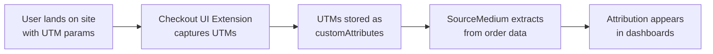

<Info>
**Audience**: This guide is for developers and technical teams implementing UTM capture at Shopify checkout.
If you're looking for general UTM best practices, see [Improving Your Last-Click Attribution](/data-inputs/platform-supporting-resources/ga4/improving-last-click-attribution).
</Info>

## Overview

SourceMedium can extract UTM attribution data from Shopify order-level `customAttributes`. This enables you to capture UTM parameters at checkout time and have them flow through to SourceMedium's attribution reporting—even when traditional tracking (GA4, cookies) fails due to ad blockers or cross-domain issues.

### When to Use This Approach

<CardGroup cols={2}>
  <Card title="Good Fit" icon="check" color="#22c55e">
    - High rates of `(direct) / (none)` attribution
    - Significant traffic from privacy-conscious browsers
    - Need server-side UTM capture as backup
    - Custom checkout flows or headless commerce
  </Card>
  <Card title="Not Needed If" icon="xmark" color="#ef4444">
    - GA4 + Elevar already capturing 90%+ attribution
    - Standard Shopify checkout with good tracking
    - Low ad blocker rates in your audience
  </Card>
</CardGroup>

---

## How It Works



<Steps>
  <Step title="Capture UTMs at Checkout">
    Your Checkout UI Extension reads UTM parameters from cookies, localStorage, or URL and writes them to checkout attributes.
  </Step>
  <Step title="Attributes Persist to Order">
    When the order is placed, Shopify stores `customAttributes` on the order record.
  </Step>
  <Step title="SourceMedium Extracts">
    During data ingestion, SourceMedium reads the allowlisted keys from `customAttributes` and maps them to standard attribution fields.
  </Step>
  <Step title="Attribution Flows Through">
    The extracted UTMs appear in Orders Deep Dive, New Customer Analysis, and other attribution reports.
  </Step>
</Steps>

---

## Supported Keys

SourceMedium extracts the following keys from `customAttributes`. **Keys are case-sensitive**—use exact lowercase.

| Key | Description | Example Value |
|-----|-------------|---------------|
| `utm_source` | Traffic source | `facebook`, `google`, `klaviyo` |
| `utm_medium` | Marketing medium | `cpc`, `email`, `social` |
| `utm_campaign` | Campaign name | `summer_sale_2025` |
| `utm_content` | Ad content identifier | `carousel_v2` |
| `utm_term` | Search term (paid search) | `running+shoes` |
| `utm_id` | Campaign ID | `120211234567890` |
| `gclid` | Google Click ID | `EAIaIQobChMI...` |
| `fbclid` | Facebook Click ID | `IwAR3x...` |
| `referrer` | Referring URL | `https://blog.example.com/review` |

<Warning>
**Case Sensitivity**: Keys must be exact lowercase. `UTM_SOURCE`, `Utm_Source`, and `utm_Source` will **not** be extracted.
</Warning>

<Note>
Keys not in this list are ignored. You can store other attributes on the order—they won't interfere with SourceMedium.
</Note>

---

## Implementation Guide

### Prerequisites

<Check>Shopify Plus or ability to create Checkout UI Extensions</Check>
<Check>Access to deploy changes to your Shopify theme/app</Check>
<Check>Method to persist UTM params across pages (cookies, localStorage, etc.)</Check>

### Step 1: Persist UTMs on Landing

Before checkout, you need UTM parameters stored somewhere accessible. Common approaches:

<Tabs>
  <Tab title="First-Party Cookies">
    ```javascript
    // On page load, capture UTMs from URL and store in cookies
    const urlParams = new URLSearchParams(window.location.search);
    const utmKeys = ['utm_source', 'utm_medium', 'utm_campaign',
                     'utm_content', 'utm_term', 'utm_id', 'gclid', 'fbclid'];

    utmKeys.forEach(key => {
      const value = urlParams.get(key);
      if (value) {
        // Set cookie with 30-day expiry, SameSite=Lax for cross-page persistence
        document.cookie = `${key}=${encodeURIComponent(value)}; ` +
                          `max-age=${30 * 24 * 60 * 60}; path=/; SameSite=Lax`;
      }
    });
    ```
  </Tab>
  <Tab title="localStorage">
    ```javascript
    // On page load, capture UTMs from URL
    const urlParams = new URLSearchParams(window.location.search);
    const utmKeys = ['utm_source', 'utm_medium', 'utm_campaign',
                     'utm_content', 'utm_term', 'utm_id', 'gclid', 'fbclid'];

    const utmData = {};
    utmKeys.forEach(key => {
      const value = urlParams.get(key);
      if (value) utmData[key] = value;
    });

    if (Object.keys(utmData).length > 0) {
      // Store with timestamp for expiry logic
      localStorage.setItem('sm_utm_data', JSON.stringify({
        data: utmData,
        timestamp: Date.now()
      }));
    }
    ```
  </Tab>
</Tabs>

### Step 2: Create Checkout UI Extension

Create a Checkout UI Extension that reads stored UTMs and writes them to checkout attributes.

```typescript
// extensions/utm-capture/src/Checkout.tsx
import { useEffect } from 'react';
import {
  reactExtension,
  useApplyAttributeChange,
  useAttributes,
} from '@shopify/ui-extensions-react/checkout';

export default reactExtension('purchase.checkout.block.render', () => <UtmCapture />);

function UtmCapture() {
  const applyAttributeChange = useApplyAttributeChange();
  const currentAttributes = useAttributes();

  useEffect(() => {
    captureUtmAttributes();
  }, []);

  async function captureUtmAttributes() {
    // Define the keys we want to capture (must match SourceMedium allowlist)
    const utmKeys = [
      'utm_source',
      'utm_medium',
      'utm_campaign',
      'utm_content',
      'utm_term',
      'utm_id',
      'gclid',
      'fbclid',
      'referrer',
    ];

    // Read from cookies (adjust based on your storage method)
    const utmData: Record<string, string> = {};

    for (const key of utmKeys) {
      const value = getCookie(key);
      if (value && value.trim() !== '') {
        utmData[key] = value;
      }
    }

    // Also capture document.referrer if not already set
    if (!utmData.referrer && document.referrer) {
      // Only capture external referrers
      const referrerHost = new URL(document.referrer).hostname;
      const currentHost = window.location.hostname;
      if (referrerHost !== currentHost) {
        utmData.referrer = document.referrer;
      }
    }

    // Apply each attribute
    for (const [key, value] of Object.entries(utmData)) {
      // Skip if already set (don't overwrite)
      const existing = currentAttributes.find(attr => attr.key === key);
      if (existing) continue;

      try {
        const result = await applyAttributeChange({
          type: 'updateAttribute',
          key,
          value,
        });

        if (result.type === 'error') {
          console.debug(`[UTM Capture] Failed to set ${key}:`, result.message);
        }
      } catch (err) {
        // Silently fail - accelerated checkout will throw
        console.debug(`[UTM Capture] Error setting ${key}:`, err);
      }
    }
  }

  // Render nothing - this extension only captures data
  return null;
}

function getCookie(name: string): string | null {
  const match = document.cookie.match(new RegExp('(^| )' + name + '=([^;]+)'));
  return match ? decodeURIComponent(match[2]) : null;
}
```

### Step 3: Configure Extension

```toml
# extensions/utm-capture/shopify.extension.toml
api_version = "2024-10"

[[extensions]]
type = "ui_extension"
name = "UTM Attribution Capture"
handle = "utm-capture"

[[extensions.targeting]]
module = "./src/Checkout.tsx"
target = "purchase.checkout.block.render"
```

### Step 4: Deploy and Test

<Steps>
  <Step title="Deploy the Extension">
    ```bash
    shopify app deploy
    ```
  </Step>
  <Step title="Test with UTM Parameters">
    Visit your store with UTM parameters:
    ```
    https://yourstore.com?utm_source=test&utm_medium=manual&utm_campaign=validation
    ```
  </Step>
  <Step title="Complete a Test Order">
    Add a product to cart and proceed through checkout.
  </Step>
  <Step title="Verify in Shopify Admin">
    View the order in Shopify Admin → Orders → [Your Order] → Additional details.
    You should see the UTM attributes listed.
  </Step>
  <Step title="Verify in SourceMedium">
    After the next data sync (typically within 24 hours), check the order in SourceMedium's Orders Deep Dive to confirm attribution appears.
  </Step>
</Steps>

---

## Important Constraints

<AccordionGroup>
  <Accordion title="Accelerated Checkout Limitation" icon="apple-pay">
    The `applyAttributeChange()` method **will fail** for buyers using accelerated checkout (Apple Pay, Google Pay, Shop Pay express).

    This is a Shopify platform limitation—these checkout flows bypass the standard checkout UI for speed.

    **Impact**: A portion of your orders (typically 10-30% depending on your audience) will not have UTM attributes captured via this method.

    **Mitigation**: Use this as a **supplement** to GA4/Elevar tracking, not a replacement.
  </Accordion>

  <Accordion title="Cart Instruction Requirements" icon="cart-shopping">
    The attribute change will fail if `attributes.canUpdateAttributes` is `false`.

    This can happen if:
    - The checkout is in a restricted state
    - Another app has locked attribute modifications

    **Best Practice**: Wrap your `applyAttributeChange` calls in try/catch and fail silently.
  </Accordion>

  <Accordion title="Timing and Race Conditions" icon="clock">
    UTM data must be available before the checkout loads. If you're using cookies, ensure:
    - Cookies are set on the landing page, not just at checkout
    - Cookie domain/path allows access from checkout
    - SameSite attribute permits cross-page access
  </Accordion>
</AccordionGroup>

---

## Validation Checklist

Use this checklist to verify your implementation:

<CheckboxGroup>
  <Checkbox id="1">UTM parameters captured on landing page (check cookies/localStorage)</Checkbox>
  <Checkbox id="2">Checkout extension deployed and active</Checkbox>
  <Checkbox id="3">Test order placed with UTM parameters</Checkbox>
  <Checkbox id="4">Attributes visible in Shopify Admin order details</Checkbox>
  <Checkbox id="5">Attribution appears in SourceMedium after next sync</Checkbox>
  <Checkbox id="6">Tested with both standard checkout and accelerated checkout (Apple Pay should gracefully fail)</Checkbox>
</CheckboxGroup>

---

## Troubleshooting

<AccordionGroup>
  <Accordion title="Attributes not appearing on orders">
    **Check these in order:**
    1. Is the extension deployed? Run `shopify app dev` and check browser console
    2. Are cookies being set? Check Application → Cookies in browser dev tools
    3. Is the extension rendering? Add a `console.log` at the start of your component
    4. Are there errors? Check for `result.type === 'error'` responses
  </Accordion>

  <Accordion title="Attributes appear in Shopify but not SourceMedium">
    **Possible causes:**
    1. **Key name mismatch**: Keys must be exact lowercase (`utm_source`, not `UTM_Source`)
    2. **Sync timing**: Wait 24-48 hours for data to flow through
    3. **Connector version**: Ensure your Shopify connector supports `customAttributes` (contact SourceMedium support)
  </Accordion>

  <Accordion title="High failure rate for attribute changes">
    **Likely cause**: Accelerated checkout usage

    Check your accelerated checkout adoption rate in Shopify Analytics. If it's high, this method will have limited coverage—that's expected.
  </Accordion>
</AccordionGroup>

---

## Related Resources

<CardGroup cols={2}>
  <Card title="Shopify Checkout Attributes API" icon="shopify" href="https://shopify.dev/docs/api/checkout-ui-extensions/latest/apis/attributes">
    Official Shopify documentation for the useApplyAttributeChange hook
  </Card>
  <Card title="Shopify GraphQL Attribute Object" icon="code" href="https://shopify.dev/docs/api/admin-graphql/latest/objects/attribute">
    Reference for the key/value Attribute structure in Shopify's Admin API
  </Card>
  <Card title="UTM Best Practices" icon="link" href="/data-inputs/platform-supporting-resources/ga4/improving-last-click-attribution">
    General guidance on UTM naming conventions and tracking hygiene
  </Card>
  <Card title="SourceMedium Attribution Waterfall" icon="sitemap" href="/data-transformations/data-enrichment">
    How SourceMedium prioritizes attribution data from multiple sources
  </Card>
</CardGroup>

---

## FAQ

<AccordionGroup>
  <Accordion title="Will this replace GA4/Elevar tracking?">
    **No.** This is a supplementary method. GA4 and Elevar capture richer data (sessions, events, page views). Use this to fill gaps where cookie-based tracking fails.
  </Accordion>

  <Accordion title="What's the priority if both GA4 and customAttributes have UTMs?">
    SourceMedium uses an [attribution waterfall](/data-transformations/data-enrichment) that prioritizes data closest to the transaction. The exact priority depends on your configuration—contact SourceMedium support for details.
  </Accordion>

  <Accordion title="Can I use the order `note` field instead?">
    **Not recommended.** The `note` field is intended for customer-facing notes ("Please leave at back door"). Using it for JSON data can cause conflicts. `customAttributes` is the proper mechanism for programmatic metadata.
  </Accordion>

  <Accordion title="How do I know if my Shopify connector supports this?">
    SourceMedium's Shopify V3 connector extracts `customAttributes` automatically. If you're on an older connector version, contact support to verify or request an upgrade.
  </Accordion>
</AccordionGroup>
