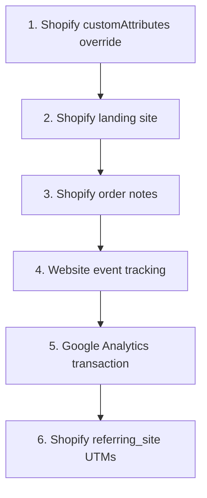

When SourceMedium receives an order, we often have attribution data from multiple first-party inputs, including Shopify order custom attributes, landing-site URL tags, order notes, website events, Google Analytics transactions, and referring-site UTMs.

The **Attribution Source Hierarchy** is our **Resolution Strategy**. It determines how we intelligently resolve conflicts when data is available from multiple places, ensuring we always use the most granular and reliable signal available for every single order.

<Info>
This is a **last-click (UTM-based) attribution** system. We prioritize data sources that capture the customer's most recent measurable marketing touch before purchase.
</Info>

<Note>
The hierarchy below ranks **primary traffic sources** only. MTA touches (`mta_first_touch`, `mta_last_touch`), zero-party survey responses, and discount-code rows can appear in the audit table as supporting context, but they do not participate in the primary traffic winner ranking.
</Note>

## Primary Attribution Source Hierarchy

The current customer-facing audit model keeps these traffic sources in preferred order:

| Preferred order | Evidence source | Description |
|----------|-------------|-------------|
| 1 | Shopify Custom Attributes Override | Order-level attribution set via Shopify `customAttributes` (Checkout / Admin GraphQL API). Treated as an explicit override (`shopify_custom_attribute_override`). |
| 2 | Shopify Landing Site | UTM parameters extracted from the order's landing page URL and related Shopify order URL tags (`shopify_landing_site`). |
| 3 | Shopify Order Notes (Legacy) | UTM data written to order notes / note attributes by tracking tools such as Elevar or Blotout (`shopify_note`). |
| 4 | Website Event Tracking | First-party website events tied back to the order (`website_event_tracking_purchase`). |
| 5 | Google Analytics Transaction | GA4 or retained historical UA transaction data tied back to the order (`google_analytics_transaction`). |
| 6 | Shopify Order Referring Site UTMs | UTM parameters parsed from the order's `referring_site` URL (`shopify_order_referring_site_utms`). |

If data is missing at the highest-ranked source, the system falls to the next available source until it finds valid traffic evidence.

<Note>
Final source ranking is deterministic and tenant-scoped at the order level. In `fct_order_attribution_audit`, the numeric field `sm_utm_final_source_priority` is an ordering signal, not a reusable source code system. `1` means "winner for this order," and you may see sparse values such as 1, 3, 4, 5, 7, and 8 instead of a compact 1..6 sequence.
</Note>



<Note>
Universal Analytics (UA) has been sunset by Google. If your organization already exported and retained historical UA data, treat it as historical-only and prefer GA4 for ongoing tracking.
</Note>

<Tip>
`fct_order_attribution_audit` keeps more than just the winning traffic source. You will also see contextual rows such as `mta_first_touch`, `mta_last_touch`, zero-party signals, and discount-code evidence. Those rows help with debugging, but they are not the primary traffic winner.
</Tip>

## Debug with `fct_order_attribution_audit`

When you need to understand why a specific order resolved the way it did, use [`fct_order_attribution_audit`](/data-activation/data-tables/sm_transformed_v2/fct_order_attribution_audit). It exposes:

- every evidence row SourceMedium kept for the order
- the per-order traffic winner via `sm_utm_final_source_priority = 1`
- raw captured fields next to the canonicalized `sm_utm_*` fields
- zero-party and discount-code rows that provide audit context

## Google Analytics Transaction Tie Rules

Google Analytics transaction records are considered tie-eligible for order matching when the transaction ID can be safely parsed into an order-like numeric key using the following logic:

1. `transaction_id` matches `^#[0-9]{4,}$` (for example `#6589`), or
2. `transaction_id` has a trailing numeric suffix with length `>= 5`.

Short non-hashtag numeric IDs remain blocked to reduce accidental collisions.

For a valid tie, the transaction-to-order window is bounded to **-1..90 days** relative to the order processed date. If a valid tie exists, this source participates in the traffic-source hierarchy.

## Website Event Tracking Details

For website event tracking sources, the system uses qualifying events in a **0..90 day window** relative to the order.

When multiple events exist, they're ranked by:
1. Days between event and order (closer to order = higher priority)
2. Event timestamp (earlier `event_local_datetime` wins ties)
3. Event ID and source system (as final tie-breakers)

If a website event has a UTM source, that's used directly. If only a referrer domain is available, the source is inferred from the domain and the medium defaults to `referral`.

## Shopify Custom Attributes Override

If your Shopify order has attribution data written to `customAttributes` (Shopify Admin GraphQL API / Checkout attributes), SourceMedium treats it as an **explicit override** and prioritizes it ahead of the default Shopify attribution sources surfaced in the audit model (landing site, order notes, website events, and Google Analytics transactions).

This is the recommended mechanism for:
- Backfilling attribution onto historical orders
- Capturing UTMs at checkout when cookie-based tracking is unreliable (ad blockers, ITP, cross-domain, etc.)

### Supported keys (allowlist)

Only a specific set of keys are extracted from `customAttributes` to prevent accidental capture of non-attribution data.

Keys are **normalized** (case + delimiter + snake/camel agnostic) before matching:
- `utm_source`, `utmSource`, `UTM_SOURCE`, `utm-source` → treated as the same key
- `sm_utmParams`, `smUtmParams` → treated as the same key
- `GE_utmParams`, `ge_utm_params` → treated as the same key

| Key | Purpose |
|-----|---------|
| `sm_utm_source`, `sm_utm_medium`, `sm_utm_campaign`, `sm_utm_content`, `sm_utm_term`, `sm_utm_id` | SourceMedium override keys (recommended to avoid collisions with other apps) |
| `utm_source`, `utm_medium`, `utm_campaign`, `utm_content`, `utm_term`, `utm_id` | Standard UTM keys |
| `sm_utmParams`, `utmParams`, `GE_utmParams` | Aggregate UTM query-string fields (parsed into individual UTM keys) |
| `sm_referrer`, `referrer` | Referring URL |

### Conflict resolution (deterministic)

If your `customAttributes` data is messy (duplicate keys, multiple sources provided), SourceMedium applies a deterministic waterfall to resolve each final field.

#### Field-level precedence

For each UTM field, the **first non-empty value wins** (highest → lowest):

1. Direct SM override key (`sm_utm_*`)
2. Direct standard UTM key (`utm_*`)
3. Parsed from `sm_utmParams` (query string)
4. Parsed from `utmParams` (query string)
5. Parsed from `GE_utmParams` (query string)
6. **`utm_source` only**: click ID inference (`scclid` → `irclickid` → `msclkid` → `ttclid` → `fbclid` → `gclid`)

`referrer` is resolved similarly: `sm_referrer` → `referrer`.

#### Duplicate keys (same tier)

If the same normalized key appears multiple times at the same tier (for example both `utm_source` and `UTM_SOURCE`, or repeated `utm_source` entries), SourceMedium de-dupes deterministically using `MAX()` (lexicographically largest value after decoding/cleaning).

To avoid surprises, only set each key once.

<Note>
Click IDs are processed as a **fallback** (see below), but the raw click ID values are not stored as attribution fields.
</Note>

### Aggregate UTM fields

If you send `sm_utmParams`, `utmParams`, or `GE_utmParams` as a URL query string (e.g., `utm_source=google&utm_medium=cpc`), SourceMedium parses it and extracts the individual UTM keys. Parsing is snake/camel agnostic (both `utm_source=` and `utmSource=` are supported) and URL-decoding is applied.

#### URL Handling

URL encoding in `sm_utmParams`, `utmParams`, and `GE_utmParams` values is fully decoded:
- Percent encoding: `%XX` patterns (e.g., `%20` → space, `%26` → `&`)
- Form-style encoding: `+` characters are decoded as spaces (common in checkout apps)

### Click ID to Channel Inference

When only a click ID is present (no explicit `utm_source`), the system infers a fallback `utm_source` value:

| Priority (highest first) | Click ID | Inferred `utm_source` | Platform |
|--------------------------|----------|------------------------|----------|
| 1 | `scclid` | snapchat | Snapchat Ads |
| 2 | `irclickid` | impact | Impact (Affiliate) |
| 3 | `msclkid` | microsoft | Microsoft/Bing Ads |
| 4 | `ttclid` | tiktok | TikTok Ads |
| 5 | `fbclid` | meta | Meta (Facebook/Instagram) |
| 6 | `gclid` | google | Google Ads |

If an order has multiple click IDs, the highest-priority click ID wins. This preserves more specific intent signals (like affiliates or smaller platforms) over ambient IDs from high-volume platforms.

Click IDs are checked in this order:
1. Direct `customAttributes` click ID keys (e.g., `scclid`, `gclid`)
2. Click IDs embedded inside `utmParams`
3. Click IDs embedded inside `GE_utmParams`

<Note>
Click IDs are **fallback only**. If an explicit `utm_source` exists, it takes precedence over any click ID inference.
</Note>

### Checkout UI Extensions (recommended)

Use Shopify Checkout UI Extensions to write attribution to checkout attributes (which become order `customAttributes`).

```typescript
import { useEffect } from 'react';
import { reactExtension, useApplyAttributeChange, useAttributes } from '@shopify/ui-extensions-react/checkout';

export default reactExtension('purchase.checkout.block.render', () => <AttributionCapture />);

function AttributionCapture() {
  const applyAttributeChange = useApplyAttributeChange();
  const attributes = useAttributes();

  useEffect(() => {
    void setAttribution();
  }, []);

  function getAttributeValue(key: string): string | null {
    return attributes.find(attr => attr.key === key)?.value ?? null;
  }

  async function setAttribution() {
    const attribution = {
      // Prefer explicit SM overrides if present; otherwise map from standard UTM attributes.
      sm_utm_source: getAttributeValue('sm_utm_source') ?? getAttributeValue('utm_source'),
      sm_utm_medium: getAttributeValue('sm_utm_medium') ?? getAttributeValue('utm_medium'),
      sm_utm_campaign: getAttributeValue('sm_utm_campaign') ?? getAttributeValue('utm_campaign'),
      sm_utm_content: getAttributeValue('sm_utm_content') ?? getAttributeValue('utm_content'),
      sm_utm_term: getAttributeValue('sm_utm_term') ?? getAttributeValue('utm_term'),
      sm_utm_id: getAttributeValue('sm_utm_id') ?? getAttributeValue('utm_id'),
    };

    for (const [key, value] of Object.entries(attribution)) {
      if (!value) continue;

      const result = await applyAttributeChange({
        type: 'updateAttribute',
        key,
        value: String(value),
      });

      if (result.type === 'error') {
        console.error('Failed to set attribution:', result.message);
      }
    }
  }

  return null;
}
```

<Warning>
Accelerated checkout methods (Apple Pay, Google Pay, Shop Pay express) may bypass checkout extension execution. Use this as a supplement to GA4/server-side tracking, not a single point of failure.
</Warning>

<Note>
Checkout UI extensions are sandboxed and can't access the browser DOM (e.g., `document.cookie`, `localStorage`, or `window.location`). Capture UTMs on the storefront and write them into cart/checkout attributes before checkout starts.
</Note>

<Note>
Custom attributes may be used by other apps. To reduce collisions, prefer `sm_utm_*` / `sm_utmParams` keys for explicit overrides (matching is normalized, but canonical keys reduce ambiguity).
</Note>

## Shopify Order Notes

Order notes are a key attribution source written by server-side tracking tools like **Elevar** and **Blotout**. These tools capture UTMs at checkout and write them to Shopify order notes / note attributes.

<Info>
If you have control over implementation, prefer **customAttributes override** instead of writing attribution into notes. Notes are shared and can be overwritten by apps; custom attributes are clearer and explicitly prioritized.
</Info>

### Note Attributes (Legacy)

The system supports extracting attribution from legacy `note_attributes` patterns, including:
- Standard UTM keys like `utm_source`, `utm_medium`, `utm_campaign`, `utm_content`, `utm_term`, `utm_id`
- Tool-specific payloads (e.g., `_elevar_visitor_info`) when they contain nested UTM data

## UTM Field Collapsing

After the primary source is determined, the system "collapses" supplementary UTM fields from lower-priority sources.

**Example:** If `shopify_custom_attribute_override` provides `utm_source=google` but no `utm_campaign`, and `shopify_landing_site` has `utm_campaign=summer_sale`, the final attribution can combine:
- `utm_source=google` (from `shopify_custom_attribute_override`)
- `utm_campaign=summer_sale` (from `shopify_landing_site`)

This only happens when the `utm_source` grouped channel is the **same** across sources—we don't mix data from different channels.

## Implementation Notes (Advanced)

- For Shopify order notes, if note-level `utm_source` is missing, note `channel` may be used as a fallback source value.
- Final `sm_utm_*` fields can be completed by downstream override logic when hierarchy output is null or direct/non-actionable.

## Related Resources

<CardGroup cols={2}>
  <Card title="Attribution in SourceMedium" icon="sitemap" href="/help-center/core-concepts/attribution/attribution-in-sourcemedium">
    Overview of last-click vs. multi-touch attribution
  </Card>
  <Card title="Improve Last-Click Attribution" icon="bullseye" href="/help-center/faq/account-management-faqs/how-can-i-improve-my-last-click-attribution">
    Tips for improving UTM tracking quality
  </Card>
  <Card title="Data Enrichment" icon="gear" href="/data-transformations/data-enrichment">
    How we enrich and standardize your data
  </Card>
  <Card title="Attribution Health" icon="heart-pulse" href="/data-inputs/attribution-health/index">
    Check and improve your attribution data quality
  </Card>
</CardGroup>
